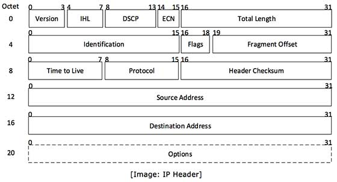

IP Service Model 负责将数据包从终端主机发送到终端主机。它不可靠，但会尽最大努力发送数据。

### **IP Service Model 的关键特性**

1. 使用数据包：数据包头部包含IP源地址和目标地址，一跳一跳地发送。
2. 不可靠：数据包可能丢失，IP不提供任何保证。
3. 尽最大的努力：IP不会随意地犯错导致数据包丢失，只在必要时才会。比如数据包队列满了，只能丢弃新发来的数据包。
4. 无连接性：每个 IP 数据包都是独立的，且可以通过不同的路由到达目标。

### IP Service为什么如此简单

1. 保持网络简单，数据包可以快速地，低成本地发送，并且更经济实惠，维护成本低。
2. 端到端原则，将尽可能多的智能放在端点上。
3. 一个简单的IP服务允许各种可靠或不可靠的服务建立在其上。

### IP Service关键细节

1. 试图阻止数据包陷入死循环。
1. 会分割较长的数据包。
1. 使用头部检查来减少数据包发向错误地址的几率。
1. 新旧兼容，目前主要运行 IPv4 和 IPv6 。分别为32位地址和128位地址。
1. 允许在头部添加新的参数。

### IPv4数据包头部结构

- **Version** − 版本号 使用的互联网协议（例如 IPv4）。
- **IHL** − 互联网标头长度； 整个 IP 标头的长度。
- **DSCP** − 区分服务代码点； 这是服务类型。
- **ECN** − 明确的拥塞通知； 它包含有关路线中拥堵情况的信息。
- **Total Length** − 整个 IP 数据包的长度（包括 IP 标头和 IP 负载）。
- **Identification** − 如果 IP 数据包在传输过程中被分片，则所有分片都包含相同的标识号。 来识别它们所属的原始 IP 数据包。
- **Flags** − 根据网络资源的要求，如果 IP 数据包太大而无法处理，这些"标志"会告诉它们是否可以分片。 在此 3 位标志中，MSB 始终设置为"0"。
- **Fragment Offset** − 此偏移量告诉原始 IP 数据包中片段的确切位置。
- **Time to Live** − 为了避免在网络中循环，每个数据包发送时都设置了一些 TTL 值，它告诉网络这个数据包可以穿过多少路由器（跃点）。 在每一跳，它的值减一，当值达到零时，数据包被丢弃。
- **Protocol** − 告诉目标主机的网络层，这个数据包属于哪个协议，即下一级协议。 例如ICMP的协议号是1，TCP是6，UDP是17。
- **Header Checksum** − 该字段用于保存整个标头的校验和值，然后用于检查数据包是否无错接收。
- **Source Address** − 数据包发送方（或源）的 32 位地址。
- **Destination Address** − 数据包接收方（或目的地）的 32 位地址。
- **Options** − 这是可选字段，如果 IHL 的值大于 5，则使用该字段。这些选项可能包含安全性、记录路由、时间戳等选项的值。