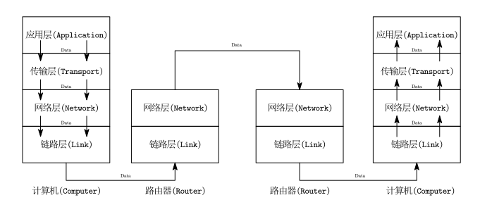

四层网络模型如下所示：

```
--------------------
|应用层(Application)|
--------------------
|传输层(Transport)  |
--------------------
|网络层(Network)    |
--------------------
|链路层(Link)       |
--------------------
```

链路层：实现**同一局域网内**主机与主机之间的数据传输，负责**MAC 地址识别和帧传输**。

网络层：实现**不同网络之间的数据转发**，通过**IP 地址进行寻址与路由选择**。

传输层：实现**端到端通信**，提供**可靠性(TCP)或高效性(UDP)**的数据传输服务。

应用层：面向用户，提供各种**具体的网络服务协议**，如 HTTP、DNS、FTP 等。

通信过程：

1. **应用层** 生成要发送的数据（如浏览器发起 HTTP 请求）
2. **传输层** 封装成 TCP/UDP 报文，打上端口号等控制信息
3. **网络层** 再封装为 IP 包，打上**源 IP**和**目的 IP**
4. **链路层** 把 IP 包封装成帧（以太网帧等），准备在本地网络中发送



