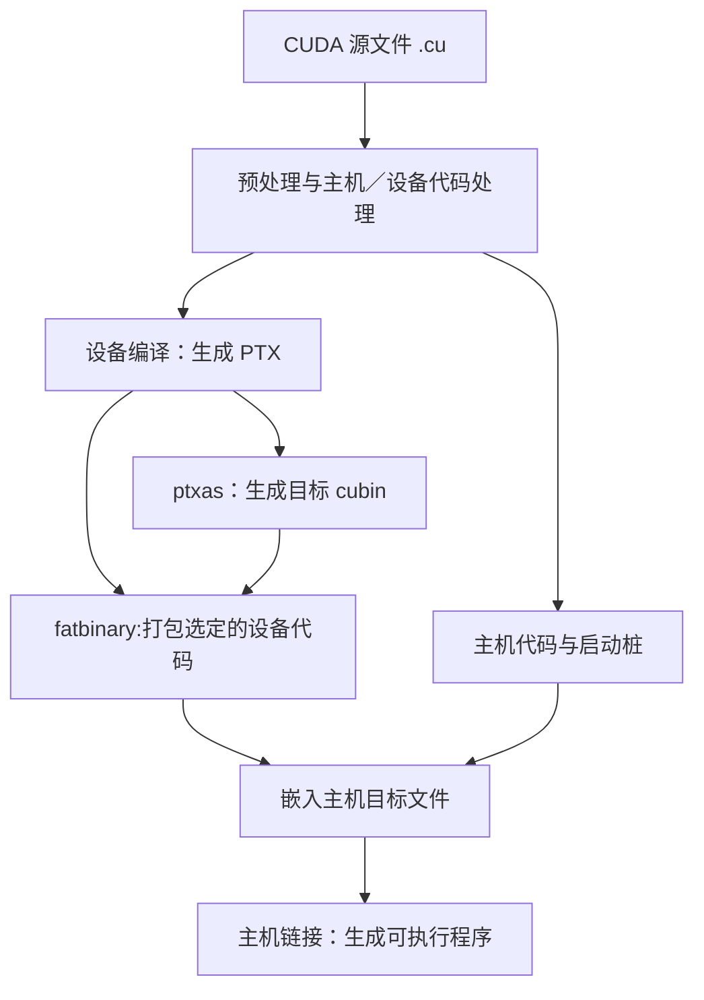

# 四种版本信息

| 名称 | 例子 | 作用 | 查看方式 |
| --- | --- | --- | --- |
| GPU 计算能力 | 8.6、12.0 | 描述硬件特性 | `cudaGetDeviceProperties()` |
| CUDA Toolkit 版本 | 12.8 | 编译器、头文件、开发工具与库的版本 | `nvcc --version` |
| NVIDIA 驱动版本 | 驱动发行编号 | 控制 GPU，提供 CUDA Driver API 和 PTX JIT | `nvidia-smi` |
| PTX ISA 版本 | PTX 文件中的 `.version` | 描述 PTX 指令语法的版本 | 查看 PTX 文件 |

计算能力 12.0 与 CUDA Toolkit 12.0 是两个独立编号。例如 GPU 计算能力为 12.0，CUDA Toolkit 版本可以为 12.8。

`nvidia-smi` 中的 `CUDA Version` 表示驱动报告最大的 CUDA 支持版本，本机实际调用的编译器版本由 `nvcc --version` 确认。

`nvcc --list-gpu-arch` 列出当前 nvcc 编译时支持指定的虚拟架构 `compute_XY`，`nvcc --list-gpu-code` 列出当前 nvcc 编译时支持指定的真实架构 `sm_XY` 。

# nvcc 如何把 .cu 编译成可执行程序

`nvcc` 是 CUDA 编译驱动，负责协调设备编译器、汇编器、主机编译器和链接器。Windows 中，主机 C++ 部分通常由 MSVC 的 `cl.exe` 编译。

一个 `.cu` 文件可以同时包含：

| 内容 | 执行位置 | 例子 |
| --- | --- | --- |
| 主机代码 | CPU | `main()`、分配内存、组织任务 |
| 设备函数 | GPU | `__device__` 函数 |
| kernel 函数 | GPU，由主机发起启动 | `__global__` 函数 |
| 主机和设备两份函数 | 分别在 CPU、GPU 执行 | `__host__ __device__` 函数 |

普通 CUDA 程序的编译流程大致如下，实际子命令和中间文件随 Toolkit 与参数变化：

1. 预处理和代码处理：解析头文件、宏以及 CUDA 语法。
2. 设备编译：按 `compute_XX` 规定的特性生成 PTX。
3. 设备汇编：`ptxas` 针对 `sm_XX` 生成 cubin，完成寄存器分配等工作。
4. 打包与主机编译：所选 cubin/PTX 进入 fatbinary，与主机代码一起组成目标文件。
5. 链接：合并目标文件及所需运行库，产生 `.exe` 。

# 兼容性

虚拟架构决定 CUDA 代码中能用哪些功能，真实架构决定 CUDA 代码如何具体执行。

例如在代码里写 `atomicAdd(double* address, double val)` 双精度浮点数原子加法，这是从 `compute_60` 帕斯卡架构才开始支持的 GPU 硬件功能，如果使用 nvcc 编译时写死编译参数为 `-arch=compute_50` ，编译就会直接报错。

一般编译时，虚拟架构和真实架构版本号保持一致或者虚拟架构版本号小于等于真实架构版本号。

真实架构 `sm_XY`：同一主版本内，低小版本编译出的机器码通常可以在高小版本 GPU 上运行，例如编译到真实架构 `sm_86` 的机器码可以在真实架构为 `sm_89` 的GPU 上运行。

虚拟架构 `compute_XY`：只要 `compute_XY` $\leqslant$ `目标 GPU 的 sm_XY`，通常可以通过驱动 JIT 编译运行。例如编译时虚拟架构为 `compute_86` 的代码可以在真实架构为 `sm_89` ，`sm_90` 的GPU上运行。
