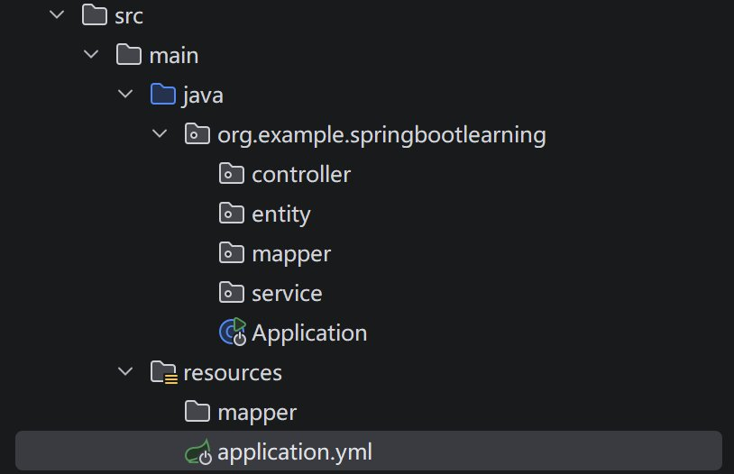

## 准备事项

1、pom.xml中引入mybatis-plus依赖：

```xml
<dependency>
    <groupId>com.baomidou</groupId>
    <artifactId>mybatis-plus-spring-boot4-starter</artifactId>
    <version>3.5.15</version>
</dependency>
```

2、pom.xml中引入MySQL依赖：

```xml
<dependency>
    <groupId>mysql</groupId>
    <artifactId>mysql-connector-java</artifactId>
    <version>8.0.33</version>
</dependency>
```

3、pom.xml中引入Lombok依赖：

```xml
<dependency>
    <groupId>org.projectlombok</groupId>
    <artifactId>lombok</artifactId>
    <version>1.18.42</version>
</dependency>
```

4、application.yml中配置数据库连接信息：

```yml
spring:
	datasource:
  		driver-class-name: com.mysql.cj.jdbc.Driver
  		url: jdbc:mysql://localhost:3306/你的数据库名?useSSL=false&serverTimezone=UTC
  		username: 你的用户名
  		password: 你的密码
```

5、创建示例数据：

```sql
//建表
DROP TABLE IF EXISTS `user`;

CREATE TABLE `user`
(
    id BIGINT NOT NULL COMMENT '主键ID',
    name VARCHAR(30) NULL DEFAULT NULL COMMENT '姓名',
    age INT NULL DEFAULT NULL COMMENT '年龄',
    email VARCHAR(50) NULL DEFAULT NULL COMMENT '邮箱',
    PRIMARY KEY (id)
);

//数据
DELETE FROM `user`;

INSERT INTO `user` (id, name, age, email) VALUES
(1, 'Jone', 18, 'test1@baomidou.com'),
(2, 'Jack', 20, 'test2@baomidou.com'),
(3, 'Tom', 28, 'test3@baomidou.com'),
(4, 'Sandy', 21, 'test4@baomidou.com'),
(5, 'Billie', 24, 'test5@baomidou.com');
```

6、为应用类添加注解( `src/main/` )

```java
@MapperScan("org.example.springbootlearning.mapper")//包名换成自己的
public class Application {
    //代码
}
```

其他：

- `resources` 目录下创建 `mapper` 目录。

- 包目录下创建 `entity` 目录

- 如下所示：

  

## 使用示例

`entity` 目录下新建实体类 `User.java` ：

```java
package org.example.springbootlearning.entity;

import com.baomidou.mybatisplus.annotation.TableName;
import lombok.Data;

@Data
@TableName("`user`")//使用数据库中的哪张表
public class User {
    private Long id;
    private String name;
    private Integer age;
    private String email;
}
```

编写 Mapper 接口类 `UserMapper.java`：

```java
package org.example.springbootlearning.mapper;

import com.baomidou.mybatisplus.core.mapper.BaseMapper;
import org.example.springbootlearning.entity.User;
import org.apache.ibatis.annotations.Mapper;

@Mapper
public interface UserMapper extends BaseMapper<User> {

}
```

在 `test` 目录下的测试类中测试

```java
package org.example.springbootlearning;

import com.baomidou.mybatisplus.core.toolkit.Assert;
import org.example.springbootlearning.entity.User;
import org.example.springbootlearning.mapper.UserMapper;
import org.junit.jupiter.api.Test;
import org.springframework.beans.factory.annotation.Autowired;
import org.springframework.boot.test.context.SpringBootTest;

import java.util.List;

@SpringBootTest
class SpringBootLearningApplicationTests {

    @Autowired
    private UserMapper userMapper;

    @Test
    public void testSelect() {
        System.out.println(("----- selectAll method test ------"));
        List<User> userList = userMapper.selectList(null);
        Assert.isTrue(5 == userList.size(), "");
        userList.forEach(System.out::println);
    }

}
```

