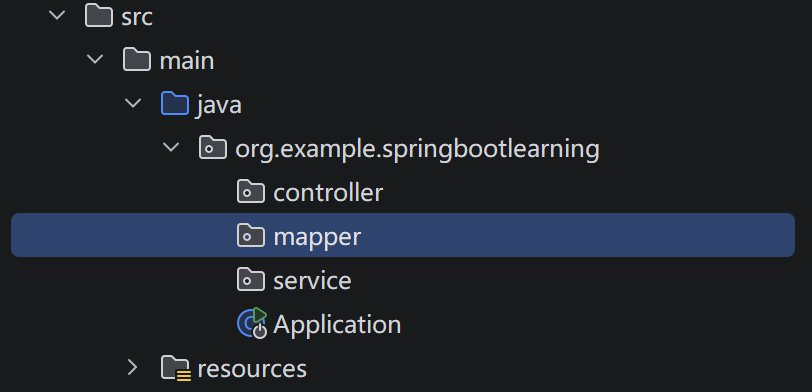

## 什么是 Spring Boot

**Spring Boot** 是一个基于 **Spring Framework** 的开发框架封装，用来快速搭建和运行 Java 后端应用；它通过提供默认配置、整合常用依赖以及内置运行环境，减少手动配置工作，使开发者可以直接编写业务代码并以一个可执行程序的形式启动服务，而无需自己搭建复杂的基础环境。

**Spring Framework** 是一个强大且广泛使用的开源 Java 应用框架，它通过**控制反转(IoC)**和**依赖注入(DI)**等核心机制，极大地简化了复杂的企业级应用程序开发流程。 它不仅提供了一个轻量级的底层容器来自动管理对象的生命周期和相互依赖关系，还无缝集成了**面向切面编程(AOP)**、安全控制、数据访问、事务管理和 Web 开发(Spring MVC)等丰富的基础设施模块，帮助开发者摒弃繁琐的底层“管道”代码，将精力集中在核心业务逻辑上，最终构建出松耦合、易于测试且高度可扩展的高质量软件系统。

## 什么是 SpringMVC

Spring MVC 是 Spring Framework 中用于构建 Web 应用的一套 MVC(Model-View-Controller)实现，它通过前端控制器 **DispatcherServlet** 统一接收 HTTP 请求，依据映射规则分发到控制器处理业务逻辑，再将结果绑定到模型并解析到视图层(如 JSP、Thymeleaf 或 REST 响应)，从而把请求处理流程拆分为可解耦的组件，便于扩展、测试和维护。

## Spring Boot 项目结构

以 Maven 构建系统为例

### 项目根目录

**pom.xml** ：Maven 的项目对象模型文件。它定义了项目的依赖项、插件和构建配置。如果使用 Gradle，则是 `build.gradle`。

**mvnw** 和 **mvnw.cmd** ：Maven Wrapper 脚本。这些脚本允许你在没有全局安装 Maven 的机器上运行 Maven 命令。`mvnw` 用于 Linux/Unix 系统，`mvnw.cmd` 用于 Windows。

**.gitignore**：通常存在，指定 git 应忽略的故意未跟踪文件(如 `target/` 目录)。

### 源代码目录( `src/` )

`src` 目录分为 `main` (用于源代码) 和 `test`(用于测试)。

#### `src/main/java`

这是你的 Java 应用程序代码所在的位置。

**包结构**: 通常遵循反向域名模式(例如 `com.example.project`)。

**应用程序类**: Spring Boot 应用程序的主入口点，使用 `@SpringBootApplication` 注解。它通常包含委托给 `SpringApplication.run` 的 `main` 方法。

#### `src/main/resources`

此目录包含运行时所需的非 Java 资源。

`application.properties` (或者 `application.yml`): 应用程序的主配置文件。你可以在这里定义数据库连接、服务器端口、日志设置和自定义属性。

`static/` (可选)： 如果你直接提供 Web 前端服务，此文件夹用于存放静态内容，如 CSS、JavaScript 和图片。

`templates/` (可选)：用于存放服务端模板引擎文件，如 Thymeleaf 或 FreeMarker。

#### `src/test/java`

此目录用于存放测试代码，可以镜像 `src/main/java` 的包结构。

**Tests**: 包含单元测试和集成测试。Spring Boot 提供了 `@SpringBootTest` 注解来简化应用程序上下文的测试。

### 构建输出( `target/` )

此目录（运行构建后创建）包含编译后的字节码(`.class` 文件)、打包后的 JAR/WAR 文件和其他构建产物，通常在版本控制中被忽略。

## 三层架构

在Spring Boot项目中，典型的三层架构可以按 **Controller、Service、Mapper** 理解：

- **Controller 层**：负责接收客户端请求(GET、POST、PUT、DELETE等)，处理请求参数，并调用 Service 层的代码完成业务处理，最后返回响应结果。
- **Service 层**：封装具体的业务逻辑和规则，协调不同 Mapper 或其他服务完成操作，同时可以处理事务管理、缓存等逻辑。
- **Mapper 层**：直接与数据库交互，通常使用 MyBatis，通过接口方法映射 SQL 语句，实现对数据的增删改查操作。

这种分层保证了各层职责清晰：Controller 不直接访问数据库，Service 不处理 HTTP 请求，Mapper 专注于数据操作，便于维护、测试和扩展。

这三个曾的工作逻辑是自上而下的：客户端请求首先由 **Controller** 接收，Controller 对请求进行解析和初步校验后，将业务操作委托给 **Service** 层；Service 层根据业务规则处理逻辑，并调用一个或多个 **Mapper** 执行数据库操作；Mapper 负责具体的数据增删改查，将结果返回给 Service，Service 再处理结果后返回给 Controller，最终由 Controller 封装成响应返回给客户端，实现请求到数据操作的完整流程。

SpringBoot项目中体现这三个层的方式是在源代码目录下创建这三个包。例如：

**注意**：controller 层下创建的类都以 controller 结尾，其他两个包也一样。

