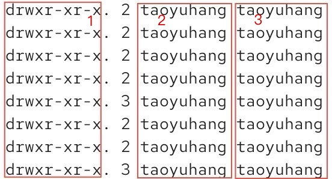

# 权限信息

`ls -l` 命令以列表形式查看内容并显示权限细节，如下图所示：

**序号1**：表示文件、文件夹的权限控制信息。

**序号2**：表示文件、文件夹的所属用户。

**序号3**：表示文件、文件夹的所属用户组。

## 权限细节

权限细节(序号1)共分为10个槽位，如图所示：

`r` ：读权限。read

`w` ：写权限。write

`x` ：执行权限。execute。

权限部分中，`-` 表示无对应权限。

针对文件和文件夹，`r`、`w`、`x` 有细微的差别。

### 针对文件

`r` ：可以查看文件内容。

`w` ：可以修改此文件。

`x` ：可以将文件作为程序执行。

### 针对文件夹

`r` ：可以查看文件夹的内容，如 `ls` 命令。

`w` ：在文件夹内：创建、删除、改名等操作。

`x` ：可以更改工作目录到此文件夹，即 `cd` 命令进入。
