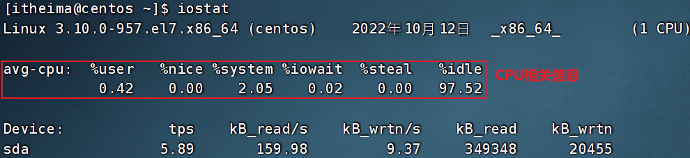
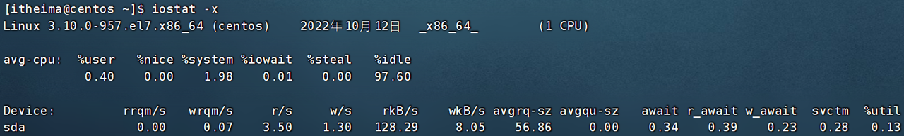

# `top` 命令

查看CPU、内存使用情况，类似Windows的任务管理器。

默认每5秒刷新一次，语法：

```bash
top
```

按 q 或 ctrl+c 退出。

### 各列指标解释：

_ PID ：进程ID。

_ USER ：进程所属用户。

_ PR ：进程优先级，越小越高。

_ NI ：负值表示高优先级，正值表示低优先级。

- VIRT ：进程使用的虚拟内存，单位KB。

- RES ：进程使用的物理内存，单位KB。

- SHR ：进程使用的共享内存，单位KB。

- S ：进程状态(S休眠，R运行，Z僵死状态，N负数优先级，I空闲状态)。

- %CPU ：进程的CPU占用率。

- %MEM ：进程的内存占用率。

- TIME+ ：进程使用的CPU时间总计，单位10毫秒。

- COMMAND ：进程的命令或名称或程序文件路径。

### `top` 命令支持的选项

`[-p]` ：显示某个进程的信息。

`[-d]` ：设置刷新时间，默认5秒。

`[-c]` ：显示产生进程的完整命令，默认是进程名。

`[-n]` ：指定刷新次数，比如 `top -n 3` ，刷新3次后退出。

`[-b]` ：以非交互非全屏模式运行，以批次的方式执行 `top` 一般配合 `-n` 指定输出几次统计信息，将输出重定向到文件，比如 `top -b -n 3 > /tmp/top.tmp` 。

`[-i]` ：不显示任何闲置(idle)或僵尸(zombie)进程。

`[-u]` ：查找特定用户启动的进程。

例如：

```bash
top -p 1 # 显示PID为1的进程

top -d 3 # 设置三秒刷新一次

top -c # 显示产生进程的完整命令

top -n 3 # 刷新3次后自动退出

top -u username # 显示指定用户的进程

```

### `top` 交互式运行

不加上 `[-b]` 选项时是交互式运行。

| 按键 |              作用               |
| :----: | :-----------------------------: |
|   h    |   显示帮助画面    |
|   c    |   显示进程的完整命令，即 `-c` 再次按下又恢复默认   |
|   f    |   选择需要展示的项目    |
|   M    |   根据驻留内存大小(RES)排序    |
|   P    |   根据CPU占用率排序   |
|   T    |   根据时间/累计时间排序   |
|   E    |   切换顶部内存显示单位    |
|   e    |   切换进程内存显示单位  |
|   l    |   切换显示平均负载和启动时间信息    |
|   i    |   不显示闲置或无用进程，即 `-i` 再次按下又恢复默认    |
|   t    |   切换显示CPU状态信息   |
|   m    |   切换显示内存信息   |

# `df` 命令

查看硬盘的使用情况，语法：

```bash
df [-h]
```

`[-h]` ：以更加人性化的单位显示。

# `iostat` 命令

查看CPU、磁盘的相关信息，语法：

```bash
iostat [-x] [num1] [num2]
```

`[-x]` ：显示更多信息。

`[num1]` ：数字，刷新间隔。

`[num2]` ：数字，刷新几次。

输入 `iostat` 的结果：



输入 `iostat -x` 的结果：



各个指标解释：

**1. rrqm/s(读合并请求数)**

每秒合并的读请求数。Linux 内核的 I/O 调度器会尝试将相邻的 I/O 请求合并，以减少磁盘寻道开销。如果该值较高，说明系统的 I/O 合并优化效果较好。


**2. wrqm/s(写合并请求数)**

每秒合并的写请求数，与 rrqm/s 类似，表示合并的写请求数量。


**3. r/s(每秒读请求数)**

每秒读取的 I/O 请求次数。


**4. w/s(每秒写请求数)**

每秒写入的 I/O 请求次数。


**5. rKB/s(每秒读取的 KB 数)**

每秒从设备读取的数据量，单位是 KB。


**6. wKB/s(每秒写入的 KB 数)**

每秒向设备写入的数据量，单位是 KB。


**7. avgrq-sz(平均请求大小)**

每个 I/O 请求的平均数据大小，单位是扇区（通常一个扇区为 512 字节）。

**8. avgqu-sz(平均请求队列长度)**

I/O 请求队列的平均长度，反映了 I/O 请求的排队情况。数值越大，表示磁盘 I/O 压力较大。


**9. await(平均 I/O 请求等待时间，单位 ms)**

I/O 请求的平均响应时间，包括等待时间和服务时间。

**10. svctm(平均服务时间，单位 ms)**

磁盘设备处理每个 I/O 请求的平均时间，不包括排队时间。一般来说，svctm 受磁盘性能影响，通常 SSD 的 svctm 远小于机械硬盘。

**11. %util(磁盘使用率)**

设备的 I/O 利用率，即在采样时间段内，磁盘在处理 I/O 请求的时间比例。接近 100% 说明磁盘 I/O 资源已经满负荷工作，可能成为系统瓶颈。