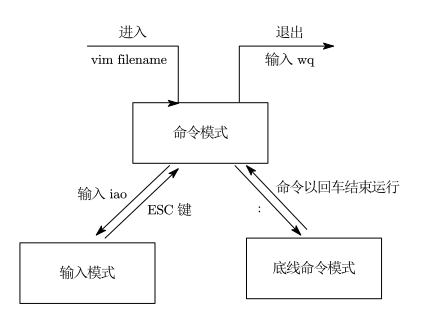

# vi \ vim 编辑器

vi \ vim 是visual interface的简称，是Linux中最经典的文本编辑器。

vi是命令行下对文本编辑的最佳选择。

vim 是 vi 的加强版，兼容所有的 vi 指令，不仅能编辑文本，而且还具有 shell 程序的功能，可以以不同颜色的文字来辨别语法的正确性，极大的方便了程序的设计和编辑性。

# vi \ vim 编辑器的三种工作模式

### 命令模式

命令模式下，所敲的键盘按键都理解为命令，以命令驱动执行不同的功能。

此模式下不能自由编辑文本。

### 输入模式

即编辑模式、插入模式。

次模式下可对文本自由编辑。

### 底线命令模式

以 `:` 开始，通常用于文件的保存、退出。



# 打开文件

由于 vim 兼容 vi 且功能更强大，所以使用 vim 的命令。

```bash
vim 文件路径
```

若文件不存在，则用于编辑新文件。

若文件已存在，则用于编辑已有文件。

# 工作模式快捷键

|   模式   | 快捷键 |              作用               |
| :------: | :----: | :-----------------------------: |
| 命令模式 |   i    |   在当前光标位置进入输入模式    |
| 命令模式 |   a    | 在当前光标位置的下一个位置进入输入模式  |
| 命令模式 |   I    |   在当前行的开头进入输入模式    |
| 命令模式 |   A    |   在当前行的结尾进入输入模式    |
| 命令模式 |   o    |  在当前光标下一行进入输入模式   |
| 命令模式 |   O    |  在当前光标上一行进入输入模式   |
| 输入模式 |  esc   | 任何情况下键入esc都回到命令模式 |
| 命令模式 |   键盘上下左右    |   上下左右移动光标    |
| 命令模式 |   键盘kjhl    | 上下左右移动光标  |
| 命令模式 |   0    |   移动光标到当前行的开头    |
| 命令模式 |   $    |   移动光标到当前行的结尾    |
| 命令模式 |   PgUp    |  向上翻页   |
| 命令模式 |   PgDn    |  向下翻页   |
| 命令模式 |  /   | 进入搜索模式 |
| 命令模式 |  n   | 向下继续搜索 |
| 命令模式 |  N   | 向上继续搜索 |
