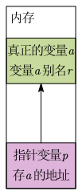
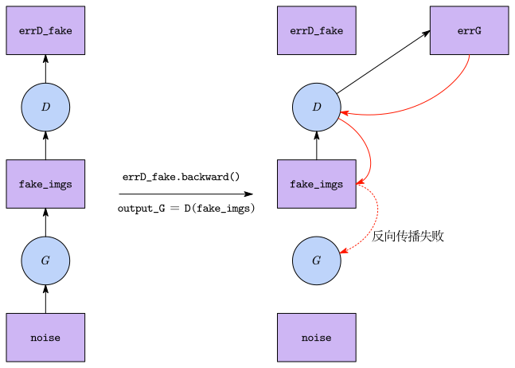
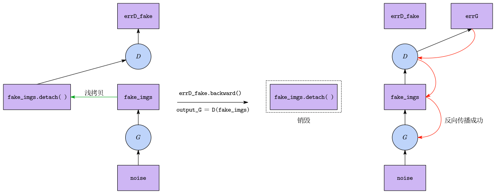

# Python 与 PyTorch 变量的本质

在 Python(包括 PyTorch)中，所有的变量本质上都是一种“指针”或“引用”，而不是数据的物理容器：

- 指针：保存地址，自己也是一个变量

- 引用：给已有变量起一个别名

内存关系大概是：



当写下 `a = torch.tensor([1.0, 2.0])` 时，真正的数据存放在内存/显存的某个地址中，`a` 仅仅是指向这块地址的指针，如果执行 `b = a`，并没有复制数据，而是多了一个名为 `b` 的指针，指向同一个内存地址。

# PyTorch Tensor 的底层

在 PyTorch 的底层实现中，一个 Tensor 对象由两个核心部分组成：

- 数据实体 (Storage)： 真正存放数值的连续内存/显存块。
- 管理外壳 (Metadata/Header)： 指针变量真正指向的东西，它包含了用于管理数据的关键信息：
    - 尺寸信息( `Shape` )：张量的维度。
    - 数据指针( `Data Pointer` )：指向具体的 Storage。
    - 梯度开关 ( `requires_grad` )： 决定是否需要计算梯度。
    - 梯度值 (`grad`): 存储反向传播计算出的梯度(它本身也是一个 Tensor 对象)。在未进行反向传播前，此项为 None。
    - 计算图指针 ( `grad_fn` )：记录了该 Tensor 是由哪个操作生成的(例如 `AddBackward` 或某个神经网络层)

# 动态计算图与反向传播

PyTorch 采用的是动态计算图 (Dynamic Computation Graph)，即代码运行到哪里，图就建到哪里。

- 建图： 当执行 `fake_imgs = G(noise)` 时，通过 `grad_fn` 将 `fake_imgs` 与生成器 `G` 的参数连接起来。
- 销毁机制： 默认情况下，每次调用 `loss.backward()` 完成反向传播后，PyTorch 会立刻销毁与该 loss 相关的计算图，以节省显存。
- 如果不加干预，对同一个图执行两次 `.backward()`，就会引发报错：`RuntimeError: Trying to backward through the graph a second time`，因为节点之间的连接已经销毁。

例子：

```python
for epoch in range(num_epochs):
    for i, (imgs, _) in enumerate(dataloader):

        # 获取当前 batch 的大小 (最后一个 batch 可能不满 64)
        batch_size = imgs.size(0)
        # 将真实图片推入显卡
        real_imgs = imgs.to(device)

        # 准备真假标签
        # 真实图片的标签全为 1，假图片的标签全为 0
        real_labels = torch.ones(batch_size, 1).to(device)
        fake_labels = torch.zeros(batch_size, 1).to(device)

        # ------------------------------------------
        # 训练判别器 D: 目标是 最大化 log(D(x)) + log(1 - D(G(z)))
        # 让 D 努力认出真图(1)，并且认出假图(0)
        # ------------------------------------------
        D.zero_grad()

        # 1. 喂给 D 真实图片，计算 D 认出真图的 Loss
        output_real = D(real_imgs)
        errD_real = criterion(output_real, real_labels)
        errD_real.backward() # 反向传播

        # 2. 生成随机噪声，并用 G 生成假图片
        noise = torch.randn(batch_size, z_dim, 1, 1).to(device)
        fake_imgs = G(noise)

        # 3. 喂给 D 假图片，计算 D 认出假图的 Loss
        # 注意：这里必须使用 fake_imgs.detach()，切断梯度传导到 G，否则会报错
        output_fake = D(fake_imgs.detach())
        errD_fake = criterion(output_fake, fake_labels)
        errD_fake.backward() # 反向传播

        # 更新 D 的参数
        errD = errD_real + errD_fake
        optimizerD.step()

        # ------------------------------------------
        # (B) 训练生成器 G: 目标是 最大化 log(D(G(z)))
        # 让 G 生成的假图尽可能骗过 D，让 D 给出 1 (真) 的评分
        # ------------------------------------------
        G.zero_grad()

        # 喂给 D 刚才生成的假图 (这次不 detach，因为要计算 G 的梯度)
        output_G = D(fake_imgs)#当前的 G 生成的图片在新的 D 下的评分

        # G 的目标是让 D 判定假图为真，所以拿 real_labels (全是1) 作为目标去计算 Loss
        errG = criterion(output_G, real_labels)
        errG.backward() # 反向传播

        # 更新 G 的参数
        optimizerG.step()
```

如果训练 $D$ 时不使用 `fake_imgs.detach()` 会报错是因为：



使用 `fake_imgs.detach()` ：



# `.detach()` 的底层原理与作用

真实行为(浅拷贝)： `fake_imgs.detach()` 没有物理复制任何数据，只是新建了一个指针变量并指向原地址。

新指针变量的 `requires_grad` 被强制设为 `False`，并且清空了计算图指针 ( `grad_fn` )。

当这个脱离了计算图的新指针变量参与前向和反向传播时，梯度传到它这里就会停下。它不仅保护了原指针变量的计算图不被 `.backward()` 销毁，还避免了计算无用梯度的算力浪费。

因为 `.detach()` 只是浅拷贝，所以对 detached 后的指针变量做修改，原指针变量的的数据也会同步改变。

如果需要脱离梯度，且能随意修改而不影响原数据，必须使用深拷贝：

- `new_tensor = old_tensor.clone().detach()`
- `.clone()` 负责在显存里开辟新空间，真正复制 Storage(但保留计算图)。
- `.detach()` 负责剥离这个新 Storage 的计算图。