# IIS + wfastcgi + bottle(flask)配置过程

## 网站配置

**1、新建一个 Python 项目(建议使用虚拟 Python 解释器以防止软件包冲突)，此项目的根目录即作为网站的根目录，并安装 wfastcgi 和 bottle 库，新建的 Python 项目如下：**

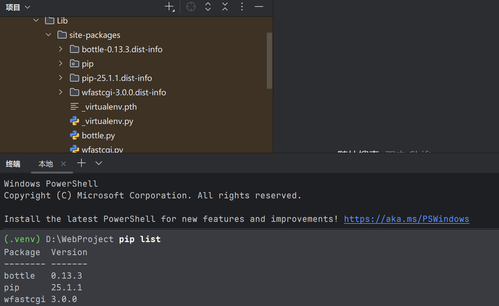

终端运行命令：`wfastcgi-enable` ，得到形如这样的路径：

```cmd
D:\WebProject\.venv\Scripts\python.exe|D:\WebProject\.venv\Lib\site-packages\wfastcgi.py
```

复制下来，再配置网站的处理程序映射时有用。

**2、进入 IIS 管理器，添加网站并配置为创建的Python项目目录：**

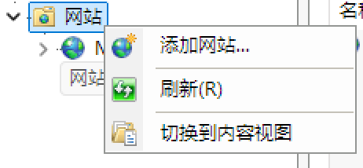

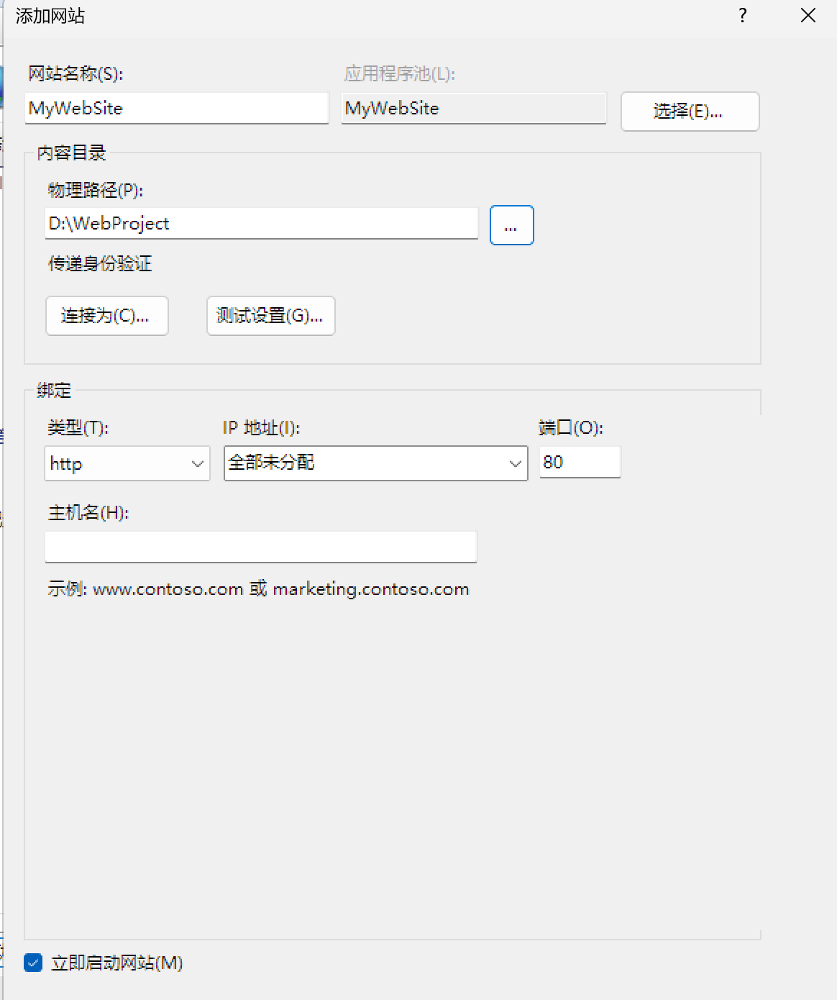


**3、进入配置编辑器，搜索节 system.webServer/handlers ，解除锁定**

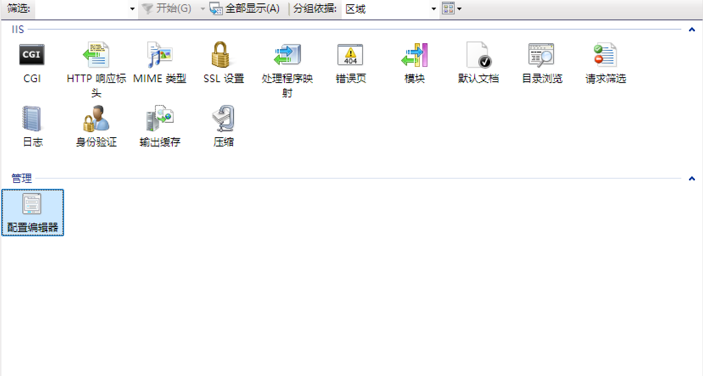

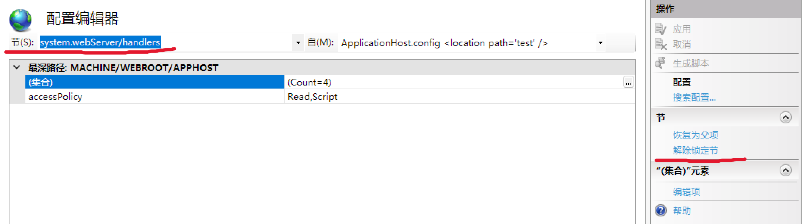

**4、进入网站配置的处理程序映射**

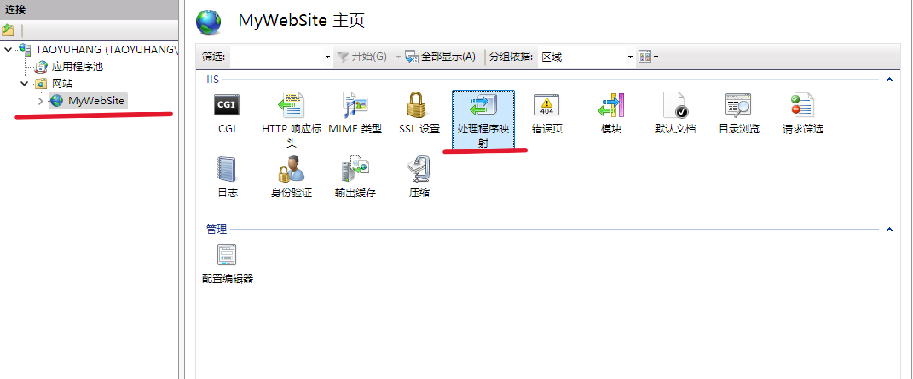

添加模块映射，配置如下：

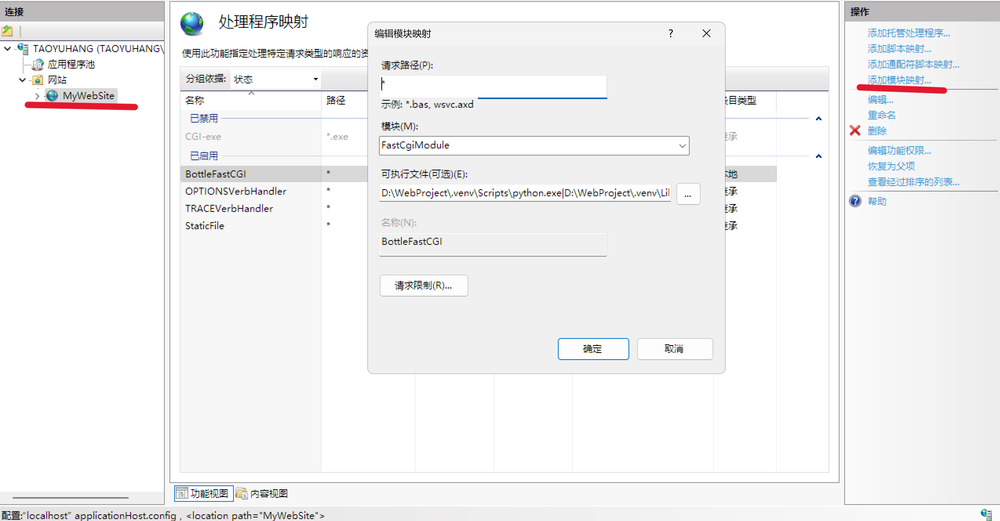

接着点击请求限制，取消勾选“仅当请求映射至以下内容时才调用处理程序程序”

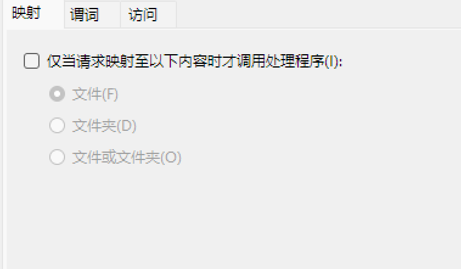

至此，网站的配置已经完成，返回 IIS 全局控制台。

**5、调整 FastCGI 设置**

退回至 IIS 全局控制台，进入 FastCGI 设置

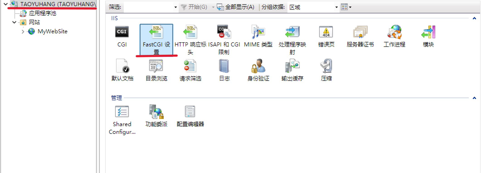

看到我们已为网站配置好的处理程序映射，双击进入，调整环境变量。

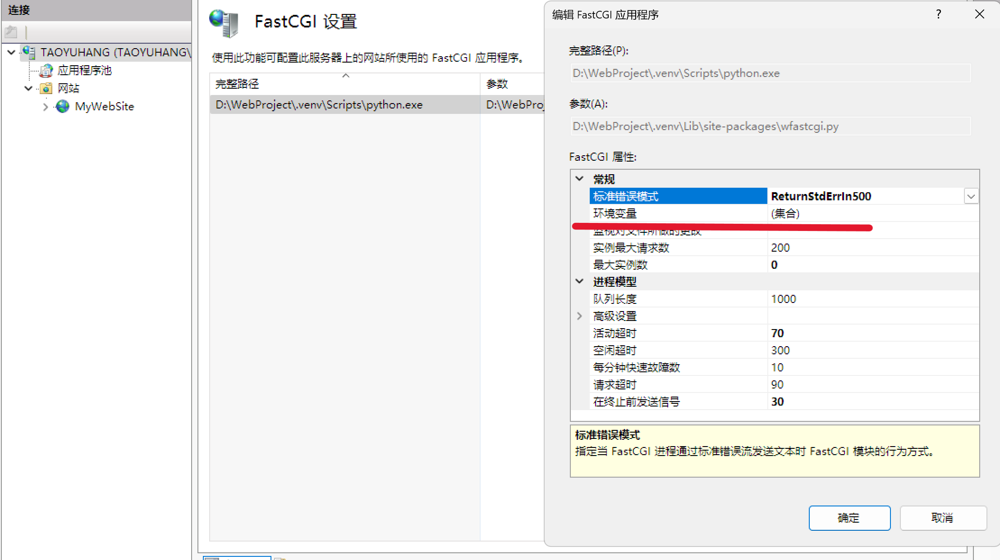

添加 `WSGI_HANDLER` 和 `PYTHONPATH` 两个环境变量，变量值如下图所示：

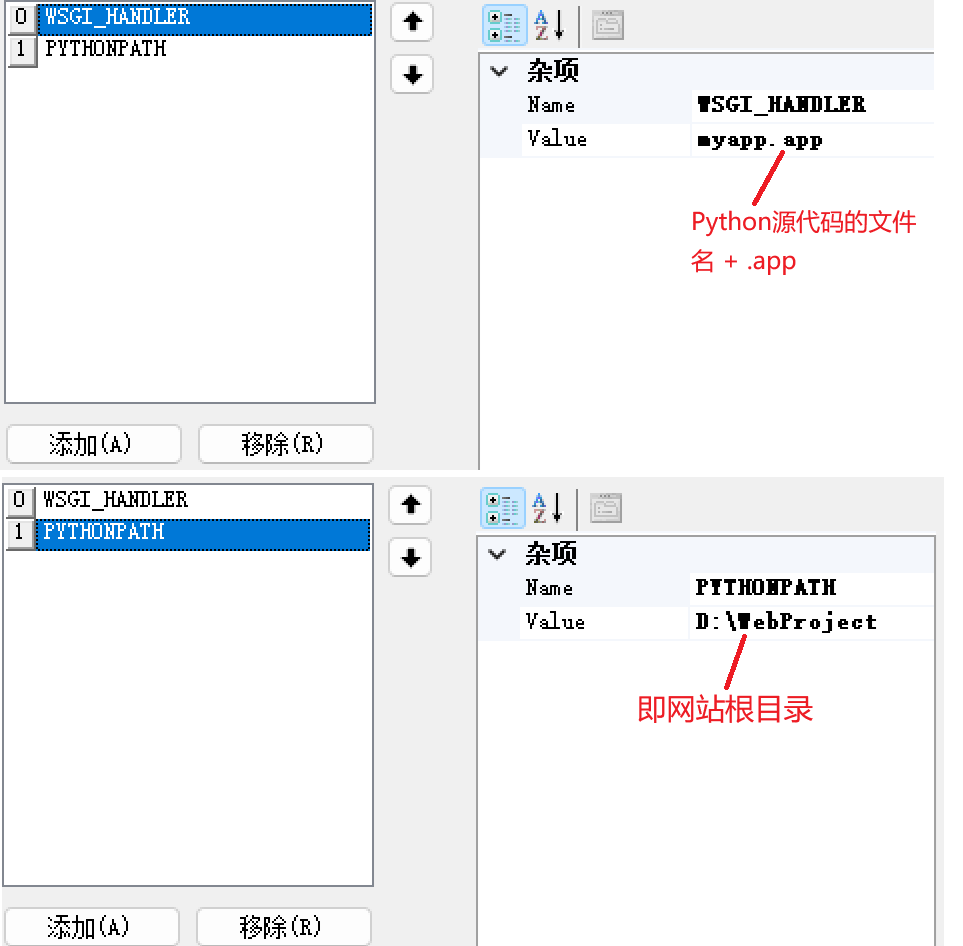

至此网站的配置已经全部完成

## 测试代码

创建 myapp.py 源代码文件

```python
from bottle import Bottle, response
import json

app = Bottle()

@app.route('/<name>')
def hello(name):
    message = {'message': f'你好, {name}！欢迎使用我们的 API'}
    response.content_type = 'application/json'
    # 手动返回 JSON，确保中文不会被转义
    return json.dumps(message, ensure_ascii=False)

# app.run()

# IIS 会使用 app 对象，无需 app.run()

```

前端 HTML 文件(index.html)

```html
<!DOCTYPE html>
<html>
<head>
    <meta charset="UTF-8">
    <title>前后端分离示例</title>
</head>
<body>
    <h2 id="msg">加载中...</h2>

    <script>
        // 调用 API，路径参数传递用户的名字
        fetch('/api/hello/BottleUser')
            .then(res => res.json())
            .then(data => {
                document.getElementById('msg').textContent = data.message;
            })
            .catch(err => {
                document.getElementById('msg').textContent = '请求失败：' + err;
            });
    </script>
</body>
</html>
```

打开浏览器，输入 localhost/xxx 运行结果如下：

