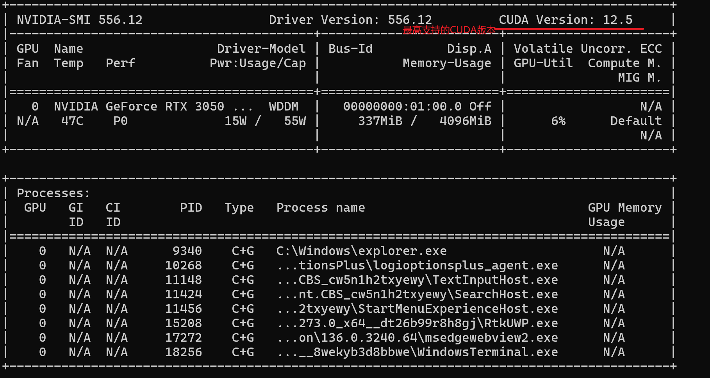
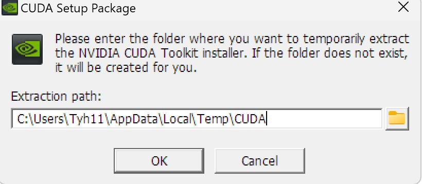
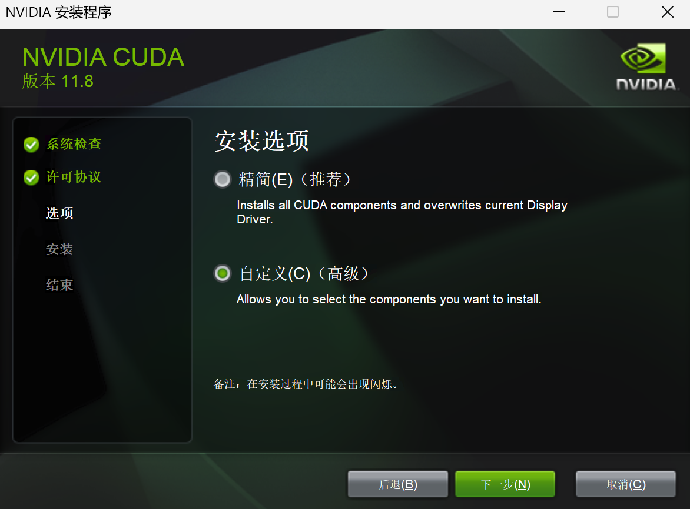
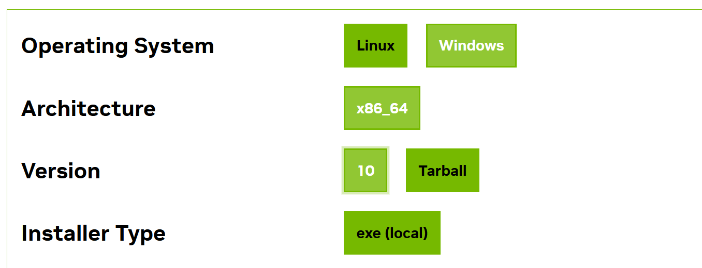
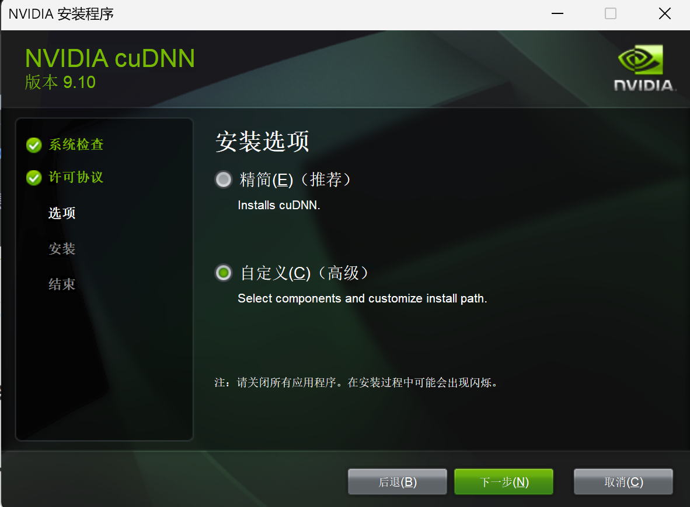
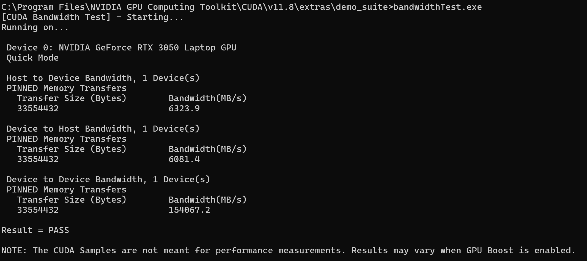

# GPU版 Pytorch 安装

## 1、Nvidia显卡驱动版本查看

cmd 输入 `nvidia-smi` ，结果如下：



## 2、安装CUDA

官网：[CUDA Toolkit Archive | NVIDIA Developer](https://developer.nvidia.com/cuda-toolkit-archive)

安装小于等于最高支持的版本即可(这里安装的是11.8)


在安装过程中选择路径的时候，第一次选择的路径下的文件夹会消失。

此处为临时安装目录（默认就可），后期安装完成会自动删除。



选择自定义安装模式(因为只需要CUDA就行了，默认安装模式会有不必要的组件)




等待安装完成，然后再 cmd 中输入 `nvcc -V` 查看是否安装成功


## 3、安装CuDNN(加速器)

官网：[cuDNN 9.10.0 Downloads | NVIDIA Developer](https://developer.nvidia.com/cudnn-downloads)

直接下载最新版的 exe 安装器就好



同样也选择自定义安装模式



选择需要的组件


进入 `C:\Program Files\NVIDIA` 目录，将 `bin` `include` `lib` 三个文件夹复制到下面这个目录：

 `C:\Program Files\NVIDIA GPU Computing Toolkit\CUDA\v11.8`

然后进入 `C:\Program Files\NVIDIA GPU Computing Toolkit\CUDA\v11.8\extras\demo_suite` 目录

再 cmd 中运行 `bandwidthTest.exe` 和 `deviceQuery.exe` ，若都成功，则CuDNN安装完成。




## 4、安装GPU版本的Pytorch

官网：[PyTorch](https://pytorch.org/)

选择稳定版，选择对应的操作系统，使用 pip 安装到项目中(项目使用虚拟 Python 解释器作隔离)

**测试代码1：**

```python
import torch
print("PyTorch Version:", torch.__version__)
print("CUDA available:", torch.cuda.is_available())
print("CUDA version in PyTorch:", torch.version.cuda)
print("Torch compiled with CUDA:", torch.backends.cuda.is_built())

print(torch.backends.cudnn.version())# 能够正确返回8200
from torch.backends import cudnn  # 若正常则静默
cudnn.is_available() # 若正常返回True
a = torch.tensor(1.)
cudnn.is_acceptable(a.cuda()) # 若正常返回True
```

**测试代码2：**

```python
import torch
print(torch.cuda.is_available())
x = torch.rand(5, 3)
print(x)
print(torch.version.cuda)
```

## 踩坑记录

### 1、使用 `pip-review` 自动安装所有可更新包

`pip-review` 会把你所有包都更新到最新版，但它默认只看 PyPI（官方源），而 PyTorch 的 **带 CUDA 支持版本并不在 PyPI 主源**，而是在 PyTorch 自己的专用源。

解决方法：强制重新安装：

```cmd
pip3 install --force-reinstall torch torchvision torchaudio --index-url https://download.pytorch.org/whl/cu118
```

