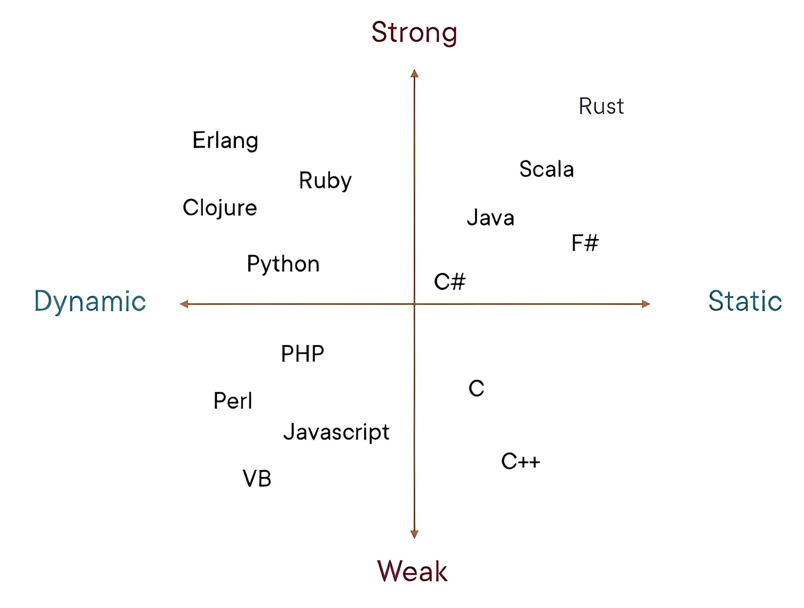

# 编程相关概念
## 静态类型与动态类型、强类型与弱类型语言
静态类型：编译时确定变量类型(C、C++、Java、Rust、Go)

动态类型：运行时确定变量类型(Python、JavaScript、Ruby、PHP)

强类型：很少/不允许隐式类型转换(Python、Java、Rust、Go)

弱类型：大量允许隐式类型转换(JavaScript、PHP、Perl)

主流的编程语言分类如下：



python强类型示例：

```python
a = 10
b = "20"
c = a + b       # TypeError，不允许隐式转换
```

C++弱类型示例：

```cpp
int a = 10;
double b = 3.14;
void* p = &a;       // 指向 int
p = &b;             // 指向 double
```

JavaScript弱类型示例

```javascript
let a = 10;
let b = "20";
let c = a + b;  // number -> string，隐式转换
```

