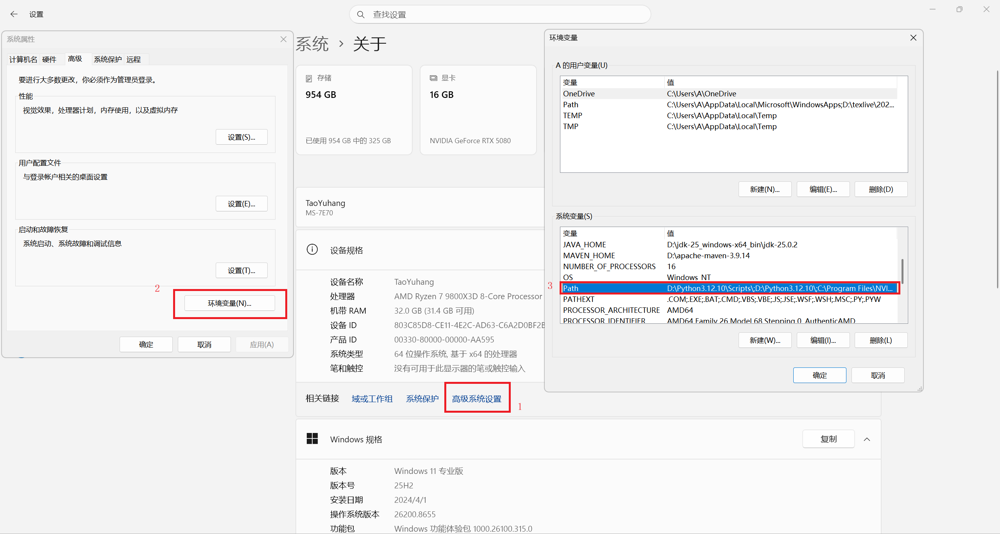
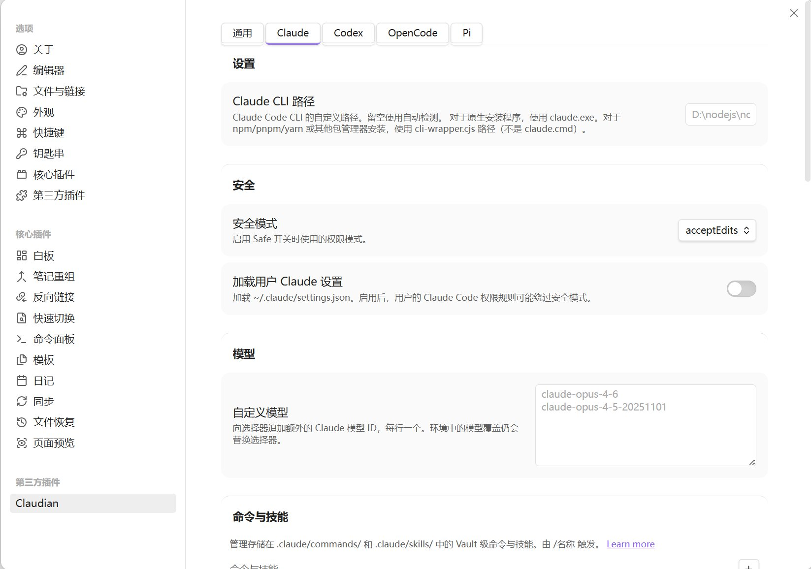
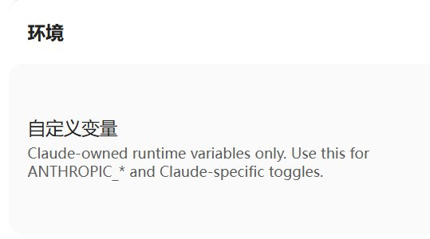

# 安装 Claude Code CLI

Claude Code CLI 的下载服务器在国内是无法直接访问的，即使已经打开了代理软件，Windows 的 PowerShell 默认情况下也不会自动走代理，导致直接裸连服务器并被防火墙拦截，所以安装时需要先在 PowerShell 中设置临时代理：

```powershell
# 依次输入，注意把冒号后面的端口号换成实际运行时的
$env:HTTP_PROXY="http://127.0.0.1:7890"
$env:HTTPS_PROXY="http://127.0.0.1:7890"
```

然后运行安装指令(https://code.claude.com/docs/en/quickstart#step-1-install-claude-code)：

```powershell
irm https://claude.ai/install.ps1 | iex
```

默认安装路径是：`C:\Users\你的用户名\.local\bin\claude.exe` ，可以直接移动到非系统盘。

然后在环境变量 `Path` 中添加 Claude Code CLI 的安装路径，例如：



# Claudian 插件设置

现在 deepseek 开放平台充值，获取 api key。

Obsidian 中安装 Claudian 插件。

DeepSeek API 使用与 OpenAI/Anthropic 兼容的 API 格式，所以可以通过修改配置在插件中使用 deepseek 。

插件设置中选择 Claude 并关闭 `加载用户 Claude 设置` 以防止加载全局的 Claude 设置(和系统环境隔离)：



然后下滑到 `环境-自定义变量` ：



填入以下配置：

```powershell
ANTHROPIC_BASE_URL="https://api.deepseek.com/anthropic"
ANTHROPIC_AUTH_TOKEN="修改成你的api key"
ANTHROPIC_MODEL="deepseek-v4-pro"
ANTHROPIC_DEFAULT_OPUS_MODEL="deepseek-v4-pro"
ANTHROPIC_DEFAULT_SONNET_MODEL="deepseek-v4-pro"
ANTHROPIC_DEFAULT_HAIKU_MODEL="deepseek-v4-flash"
CLAUDE_CODE_SUBAGENT_MODEL="deepseek-v4-flash"
```

重启 Obsidian 后就可以用了。
